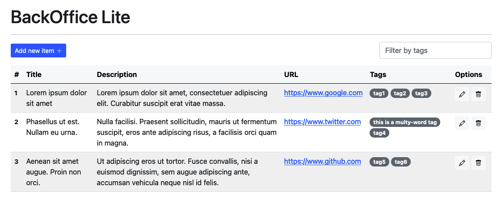
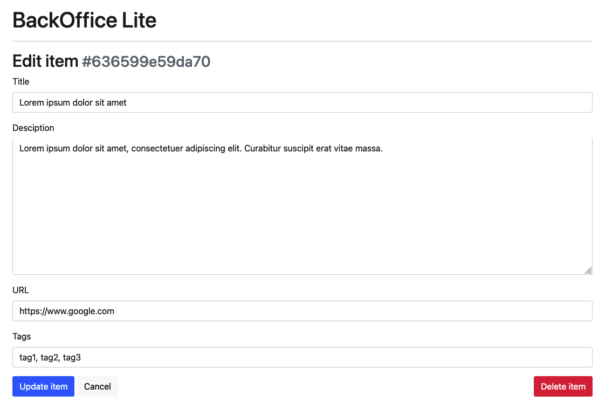

# simple-crud-php-json

This is a simple single-page CRUD backoffice, with login, and an encrypted JSON file as database.

## Preview

**List view**


**Edit view**


## Configuration

### Credentials

This is the list of user/passwords for the backoffice access.
You can include multiple users. At least one user is required.

> By defautl user name is `admin` with the password `12345678`.

```php
define("CREDENTIALS", [
    'admin' => '12345678'
]);
```

### Entries Labels

This configuration define the label text to name the database entries in the frontend.
You can set yor own text to use as label, for the single and plural uses.

> By default the entries are named `Items`.

```php
define("ENTRY_LABEL_SINGULAR", "item");
define("ENTRY_LABEL_PLURAL", "items");
```

### Database

#### File location

This is the web server path to the database json file.
> If possible, move the file outside the web served folder to restrict public access to this file.

```php
define("DB_FILE", __DIR__ . "/db.json");
```

#### Security features

By default the database file is not protected and is accesible by the general public.

To secure its contents, all the data is encrypted with a secret key.
> Is recomended that you set your own secret key.

```php
define('ENCRYPT_KEY', 'v[fjV0FhY<d9KZ;hraEUzWVwtdZvE-');
```


